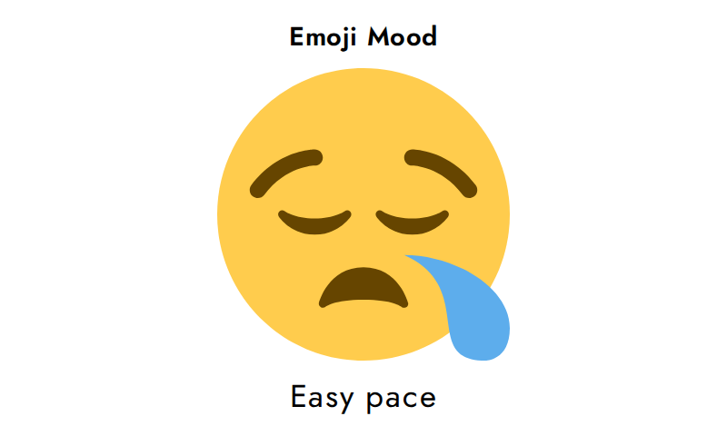
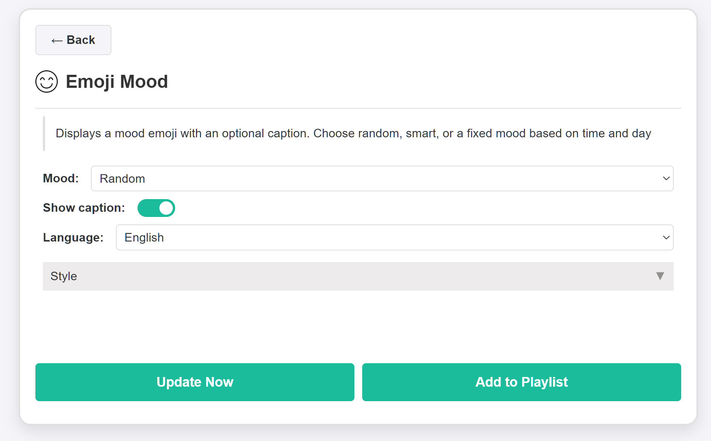

# Emoji Mood Plugin for InkyPi

Emoji Mood is a playful and minimal widget that displays a mood emoji with an optional caption. It supports fixed, random, and smart mood modes, adapting to time and day when needed.

## Install

Install the plugin using the InkyPi CLI, providing the plugin ID and GitHub repository URL:

```bash
inkypi plugin install emoji_mood https://github.com/saulob/InkyPi-Emoji-Mood
```

This plugin is an extension for the [InkyPi](https://github.com/fatihak/InkyPi) e-paper display frame and includes the following features:

## Features

* Displays a large emoji optimized for e-paper readability
* Optional caption below the emoji
* Mood modes:
  * Random
  * Smart (based on time and day)
  * Fixed categories (Adventure, Focus, Fun, Happy, Love, Low Energy, Neutral, Sick, Stress, Weird)
* Multi-language caption support
* Clean and minimal layout
* No API key required

## Settings

* Mood
  * Random
  * Smart (time and day based)
  * Fixed mood categories
* Show caption
* Language
* Style

## Details

Emoji Mood is a lightweight ambient widget designed to bring personality to your InkyPi dashboard.  

Smart mode adjusts moods dynamically based on time of day and day of week, while fixed modes allow you to lock a specific vibe.

It is ideal for playlists, side widgets, or simple dashboards where you want something expressive and easy to read at a glance.

## Screenshots

- Widget on the main dashboard
- Plugin settings screen

<p align="center">   </p>
